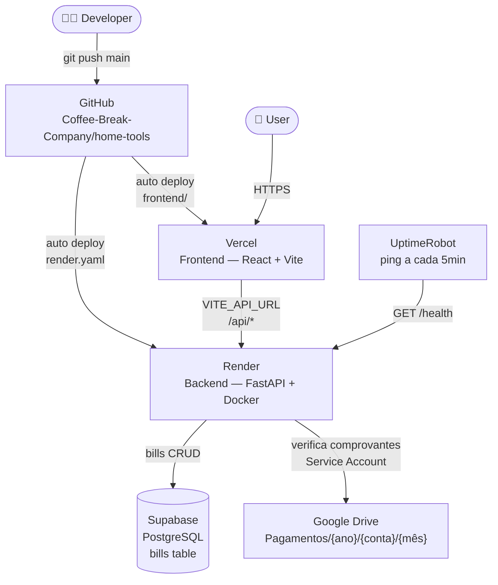

# home-tools

Ferramentas para gestão interna da casa.

## Arquitetura



## Stack

| Camada | Tecnologia |
| --- | --- |
| Frontend | Vite + React + TypeScript + Tailwind v4 + shadcn/ui |
| Backend | FastAPI + uv (Python) |
| Banco de dados | Supabase (PostgreSQL) |
| Armazenamento | Google Drive |
| Host frontend | Vercel |
| Host backend | Render (Docker) |

## Desenvolvimento local

**Backend:**

```bash
cd backend
uv run uvicorn main:app --reload
```

**Frontend:**

```bash
cd frontend
npm run dev
```
